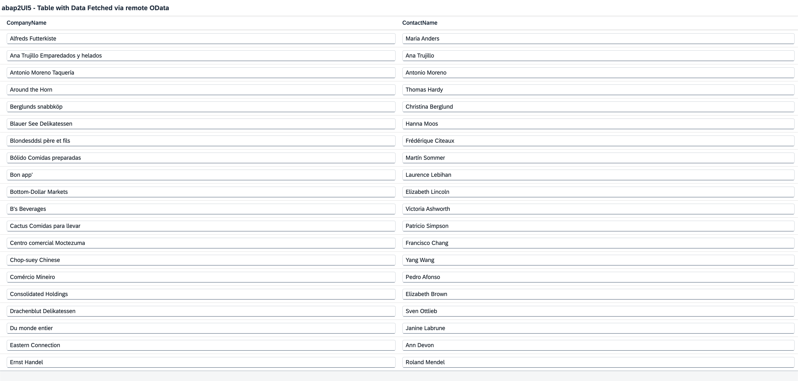
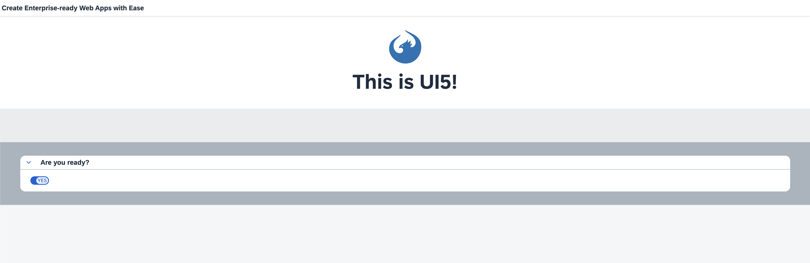

[](https://github.com/cap2UI5/dev/actions/workflows/sync.yml)

# 🚀 cap2UI5

Bringing the [abap2UI5](https://github.com/abap2UI5/abap2UI5) concept to CAP/Node.js.

> [!IMPORTANT]
> **Everything in this project is generated automatically.** The entire
> codebase, all documentation, and the
> [web version](https://github.com/cap2UI5/web-cap2UI5) were created by AI
> (Claude) and by an automated sync pipeline that mirrors and transpiles the
> upstream [abap2UI5](https://github.com/abap2UI5/abap2UI5) sources — nothing
> here is hand-written. See the [root README](../README.md) for how the
> pipeline works. Review and test before relying on it.

#### Features
* XML View Generation - Create UI5 views programmatically in your backend
* Data Binding & Exchange - Seamless two-way data binding between frontend and backend
* Session Management - Built-in persistence and session handling (optional)

#### Benefits
* Security
* Speed

## Getting Started

Prerequisites: Node.js ≥ 20 and internet access (the frontend loads SAPUI5
from the CDN). No database setup is needed — CAP deploys an in-memory
SQLite automatically on startup.

```bash
# from the repository root
cd cap2UI5
npm install

# start the server (restarts on file changes)
npx cds watch
# or: start and open the app in the browser right away
npm run watch-z2ui5
```

The server listens on [http://localhost:4004](http://localhost:4004):

| URL | What you get |
|---|---|
| `http://localhost:4004/z2ui5/webapp/index.html` | the app — without a parameter the startup app is shown |
| `http://localhost:4004/z2ui5/webapp/index.html?app_start=z2ui5_cl_app_hello_world` | start a specific app class via the `app_start` parameter (works for every sample, e.g. `z2ui5_cl_demo_app_001`) |
| `http://localhost:4004/rest/root/z2ui5` | the roundtrip endpoint the frontend talks to |

For a one-off run without file watching use `npm start` (`cds-serve`).

## Transpiling from ABAP

App classes can be transpiled automatically from the abap2UI5 ABAP sources —
the transpiler and all other dev tooling live at the repository root, see the
[root README](../README.md).

## Samples
All samples demonstrate complete view definition and data exchange handled entirely by the CAP server, using the same and static frontend from abap2UI5.

#### 1. Hello World
###### App
```js
class z2ui5_cl_app_hello_world {
  async main(client) {

    this.NAME ??= 'test';

    client.oView
      .Page({ title: "abap2UI5 - Hello World" })
      .Title({ text: "Make an input here and send it to the server..." })
      .Input({ 
        value: client._bind_edit(this.NAME), 
        enabled: true 
      })
      .Button({ 
        press: client._event('BUTTON_POST'), 
        text: "Post" 
      });
    client.display_view(client.oView.stringify());

  }
}
```
###### Demo


####  2. Fetch Data via Remote Odata
###### Package.json
```json
      "northwind": {
        "kind": "odata-v2",
        "model": "srv/external/northwind",
        "credentials": {
          "url": "https://services.odata.org/V2/Northwind/Northwind.svc/"
        }
      }
```
###### App
```js
class z2ui5_cl_app_read_odata {
  async main(client) {

    const northwindAPI = await cds.connect.to("northwind");
    this.aCustomers = await northwindAPI.run(SELECT.from("Customers"));


    const Z2UI5_CL_XML_VIEW = require("../abap2ui5/02/z2ui5_cl_xml_view");
    var oView = new Z2UI5_CL_XML_VIEW();
    var oPage = oView.Page({ title: "abap2UI5 - Table with Data Fetched via remote OData" });

    var oTab = oPage.Table({ items: client._bind_edit(this.aCustomers) });
    var oColumns = oTab.columns();
    oColumns.Column().Text({ text: `CompanyName` });
    oColumns.Column().Text({ text: `ContactName` });

    oTab
      .items()
      .ColumnListItem()
      .cells()
      .Input({ value: `{CompanyName}`, enabled: true })
      .Input({ value: `{ContactName}`, enabled: true });

    client.display_view(oView.stringify());

  }
}
```
##### Demo


#### 3. Display a Server Side XML
###### View1.view.xml
```xml
<mvc:View
	controllerName="Quickstart.App"
	displayBlock="true"
	xmlns:mvc="sap.ui.core.mvc"
	xmlns:l="sap.ui.layout"
	xmlns:core="sap.ui.core"
	xmlns:tnt="sap.tnt"
	xmlns="sap.m">
	<App id="app">
		<Page title="Create Enterprise-ready Web Apps with Ease">
			<l:BlockLayout background="Light">
				<l:BlockLayoutRow>
					<l:BlockLayoutCell>
						<core:Icon color="#1873B4" src="sap-icon://sap-ui5" size="5rem" class="sapUiSmallMarginBottom" width="100%"/>
						<Title level="H1" titleStyle="H1" text="This is UI5!" width="100%" textAlign="Center"/>
					</l:BlockLayoutCell>
				</l:BlockLayoutRow>
				<l:BlockLayoutRow>
					<l:BlockLayoutCell>
						<FlexBox items="{/features}" justifyContent="Center" wrap="Wrap" class="sapUiSmallMarginBottom">
							<tnt:InfoLabel text="{}" class="sapUiSmallMarginTop sapUiSmallMarginEnd"/>
						</FlexBox>
					</l:BlockLayoutCell>
				</l:BlockLayoutRow>
				<l:BlockLayoutRow>
					<l:BlockLayoutCell>
						<Panel headerText="Are you ready?" expandable="true">
							<Switch change=".onChange" customTextOn="yes" customTextOff="no"/>
							<l:HorizontalLayout id="ready" visible="false" class="sapUiSmallMargin">
								<Text text="Ok, let's get you started!" class="sapUiTinyMarginEnd"/>
								<Link text="Learn more" href="https://openui5.hana.ondemand.com/"/>
							</l:HorizontalLayout>
						</Panel>
					</l:BlockLayoutCell>
				</l:BlockLayoutRow>
			</l:BlockLayout>
		</Page>
	</App>
</mvc:View>
```
###### z2ui5_cl_app_read_view
```js
class z2ui5_cl_app_read_view {
  async main(client) {

    this.client = client;
    const fs = require("fs");
    const path = require("path");
    const viewPath = path.join(__dirname, "View1.view.xml");
    const viewContent = fs.readFileSync(viewPath, "utf8");
    client.display_view(viewContent);

  }
}

```
###### Demo


### Contribution
Contributions are welcome! Feel free to fork the project, submit issues, or create pull requests.

### License
This project is licensed under the MIT License.
